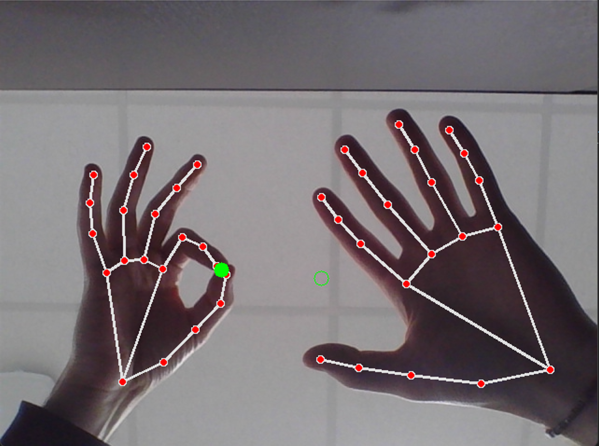

# Hand Tracking 

## Description
This Python script utilizes MediaPipe and OpenCV to track hand movements in real-time using a webcam. It visualizes hand landmarks and their connections, serving as a foundation for more complex applications such as gesture recognition or augmented reality interfaces.
<br /> 
handtracking_mouse.py script moves your mouse pointer and can simulate clicks.



## Installation
Ensure Python and the necessary libraries are installed:
```
pip install opencv-python mediapipe numpy
```

## Requirements
Python 3.6 or later
OpenCV 4.0 or later
MediaPipe
NumPy
PyAutoGUI


